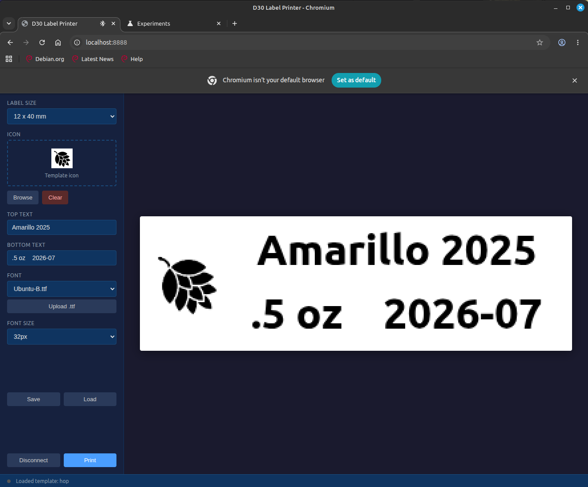
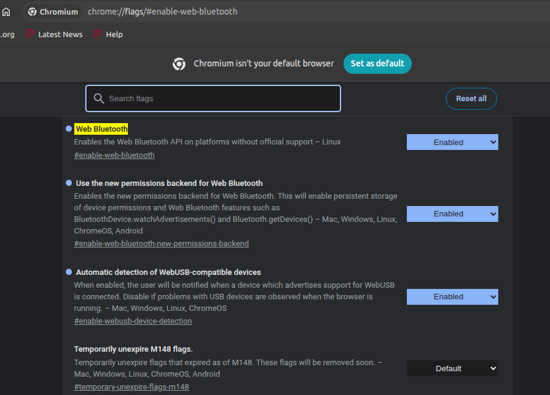

# Studio D30

Web-based label designer and printer for the Phomemo D30 thermal label printer over Bluetooth Low Energy.



## Overview

A zero-dependency, single-file HTML/CSS/JS application that uses the Web Bluetooth API to design and print labels directly from your browser. No build step, no backend, no install.

## Features

- Compose labels with icon, top text, and bottom text (all optional, layout adapts dynamically)
- Live canvas preview at actual label proportions (96x320 dots)
- Upload custom icons (drag-and-drop or file picker)
- Upload custom .ttf fonts
- Multiple label sizes supported (12mm to 15mm widths, 22mm to 50mm lengths)
- Save/load label templates via localStorage
- Connect and print over BLE directly from the browser
- Responsive layout - label preview scales to fit narrow browser windows

## Browser Requirements

Requires the Web Bluetooth API: **Chrome**, **Edge**, or **Opera**.

Not supported in Firefox or Safari.

### Chromium BLE Configuration

You may need to enable the Web Bluetooth flag in Chromium-based browsers:



Navigate to `chrome://flags/#enable-web-bluetooth` and ensure it is enabled.

## Getting Started

```
python3 -m http.server 8888
```

Then open http://localhost:8888 in Chrome/Edge.

## Tips

- **Use black/white icons.** The printer is 1-bit monochrome - all pixels are thresholded to pure black or white (below 50% gray = black dot). Color or grayscale icons may lose detail. For best results, use simple high-contrast artwork.

## Usage

1. Select a label size from the dropdown
3. Add an icon, top text, and/or bottom text as needed
4. Choose a font and size
5. Click **Connect** and select your D30 printer from the BLE device picker
6. Click **Print**

## Troubleshooting (Linux)

If the printer won't connect:

1. Wake the printer - press the D30's button (it sleeps after a few seconds)
2. Disconnect at OS level - the web app can't connect if the system already holds a BLE connection
   ```
   bluetoothctl disconnect <ADDRESS>
   ```
3. Remove stale pairing data
   ```
   bluetoothctl remove <ADDRESS>
   ```
4. Restart Bluetooth service
   ```
   sudo systemctl restart bluetooth
   ```
5. Check permissions - your user needs to be in the `bluetooth` group
   ```
   sudo usermod -aG bluetooth $USER
   ```

## Printer Details

| Parameter | Value |
|-----------|-------|
| BLE service UUID | `0000ff00-0000-1000-8000-00805f9b34fb` |
| BLE write characteristic | `0000ff02-0000-1000-8000-00805f9b34fb` |
| Printhead width | 96 dots (12 bytes) |
| Raster format | ESC/POS GS v 0 |

## Label Sizes

| Size (mm) | Notes |
|-----------|-------|
| 12 x 22 | Small |
| 12 x 30 | Medium |
| 12 x 40 | Standard (default) |
| 14 x 22 | Wider, short |
| 14 x 30 | Wider, medium |
| 14 x 40 | Wider, long |
| 14 x 50 | Wider, extra long |
| 15 x 30 | Widest, medium |

## Files

| File | Purpose |
|------|---------|
| `index.html` | The app (HTML + CSS + JS, single file) |
| `label.py` | Standalone CLI print script (not needed for the web app) - see below |
| `project.md` | Architecture and design notes |
| `wireframe.md` | UI wireframe description |
| `todo.md` | Implementation checklist |

## License

## CLI Printing (label.py)

A standalone Python script for printing from the command line without a browser. Requires [Bleak](https://github.com/hbldh/bleak) and Pillow. The web app does not use this - it connects via the browser's BLE device picker instead.

```
python3 label.py <BLE_ADDRESS> "Hello D30!"
```

You can find your printer's BLE address with `bluetoothctl scan le`.

## License

See [LICENSE](LICENSE).
